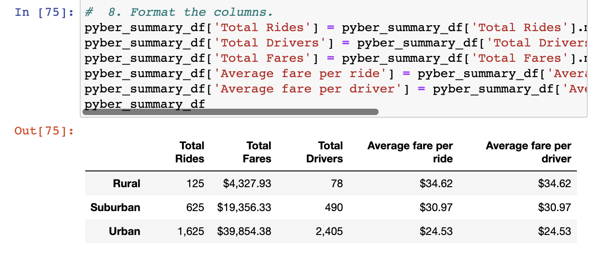
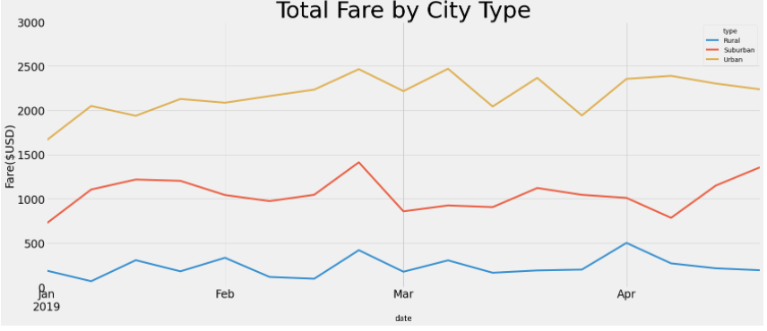

# PyBer Analysis

## Overview

The primary objective of this project is to generate a line graph that visually presents fare data categorized by city type. By leveraging data from the provided CSV files, I successfully organized the information into three distinct city types: urban, suburban, and rural. Through this categorization, I extracted essential metrics such as the total number of rides in each city type, the corresponding number of drivers, the aggregate fare amounts, the average fare per ride, and the average ride per driver.

Using these derived metrics, I created a comprehensive line graph that effectively illustrates the variations in fares across different city types. These visual representations enable a clear comparison of fare trends, providing insights into the relative patterns and differences among urban, suburban, and rural areas.

By effectively presenting the data through a line graph, this project enables stakeholders to grasp a comprehensive overview of fare dynamics across various city types. The derived metrics further contribute to a deeper understanding of the transportation landscape, facilitating informed decision-making and strategic planning in relation to pricing, driver allocation, and resource optimization.

## Results

The analysis reveals a notable disparity in fare prices between rural cities and suburban or urban cities, with rural fares being considerably higher. This discrepancy can be primarily attributed to the lower availability of drivers in rural areas. Due to the sparser population and geographical layout of rural cities, drivers often have to cover longer distances on average, resulting in increased fares.

The limited number of drivers in rural cities leads to higher demand for their services, which in turn drives up the fare prices. As a result, the average fare per driver in rural cities tends to be approximately four times higher than that in urban cities. This significant difference reflects the impact of supply and demand dynamics within different city types.

The unique characteristics of rural areas, such as their vast expanse and lower population density, necessitate drivers to travel greater distances to serve customers. Consequently, the cost per ride in rural cities is higher, reflecting the increased effort and time required by drivers to reach their destinations.

Additionally, with the multiple-line char, we can see that the total fares during the year are different for each type of city. Fares spike slightly during late February all across the board. Meanwhile, in late April, suburban fares spike while urban and rural fares decrease.

## Summary

Conducting research to investigate the reasons behind the surge in suburban fares during April is crucial for the business. By identifying the underlying factors contributing to this price spike, the company can effectively adapt and tailor its services to meet the specific demands of suburban customers during that period. This research-driven approach will enable the business to proactively address the unique dynamics of the suburban market, ensuring optimal service delivery and customer satisfaction.

Additionally, the company can strategically adjust the number of drivers in response to fare prices. For instance, if fares are relatively high, the business may consider increasing the number of drivers to accommodate the demand and avoid excessive costs for customers. Conversely, if fares are lower, the company can assess the driver-to-customer ratio and make appropriate adjustments to ensure efficient resource allocation.

Considering the higher fares in rural areas, it becomes essential for the company to increase the number of drivers in those regions. By doing so, the company can mitigate the cost barrier for potential customers, making the services more affordable and accessible. This approach demonstrates a commitment to expanding service availability in rural areas and promoting inclusivity while considering the unique pricing dynamics of different locations.

By combining thorough research, strategic driver management, and targeted service expansion, the business can effectively optimize its operations, enhance customer experiences, and capitalize on market opportunities across urban, suburban, and rural areas.
