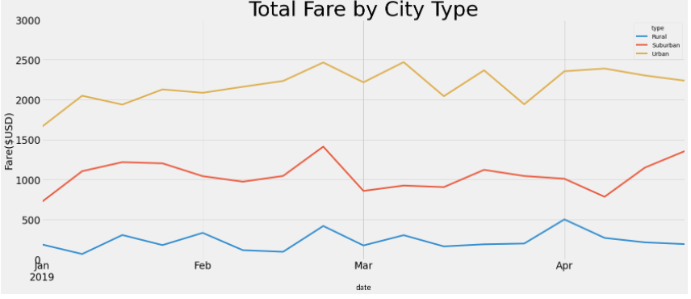

# PyBer Analysis

## Overview

The purpose of this project is to create a line graph that shows the fares by type of city. Using the data from the csv files, I was able to sort it according to 3 types of cities: urban, suburban, and rural. From that, I found the total rides in each type of city, the number of drivers, the total fares, average fare per ride, and the average ride per driver.

## Results

The results indicate that the fares are much higher in rural cities than they are in suburban or urban cities. However, that I likely due to the fact that there are fewer drivers in rural cities. Rural cities are also much more spread out so drivers end up driving further on average. That would explain why the average fare per driver in rural cities is about 4 times higher than that of urban cities.

Additionally, with the multiple-line char, we can see that the total fares during the year are different for each type of city. Fares spike slightly during late February all across the board. Meanwhile, in late April, suburban fares spike while urban and rural fares decrease.

## Summary

The business should research what causes the spike in suburban fares in April and structure their services accordingly. 

The business can also focus on increasing or decreasing the number of drivers according to the price of the fares.

Because the fares are higher in rural areas, the company can increase the number of drivers there so that it isn't too expensive for people to use the services there.
